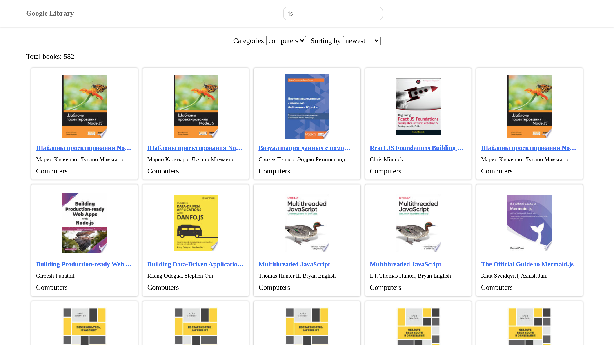

# [Google Library](https://library-fd55a.web.app)

The project based on [Google Books API](https://developers.google.com/books/docs/v1/getting_started)

# Used technologies

* [React](https://reactjs.org/)
* [Redux](https://redux.js.org/)
* [React Redux](https://react-redux.js.org/)
* [Redux Thunk](https://github.com/reduxjs/redux-thunk)
* [Jest](https://jestjs.io/docs/getting-started)
* [React Testing Library](https://testing-library.com/docs/)
* [Less](https://lesscss.org/)
* [Typescript](https://www.typescriptlang.org/docs/)

# The project allows you

* Find any books in differrent categories;
* Filter books by relevance and newest;
* View a book details;
* Read a book's free fragment

# To start project

* Clone this respository `git clone https://github.com/svfd/google-library`
* Go to folder with this project
* Install all dependencies `npm install`
* Run a development server `npm start`

### To build this project

* `npm run build`

# Run tests

* Once `npm run test`
* In the watch mode `npm run test:watch`